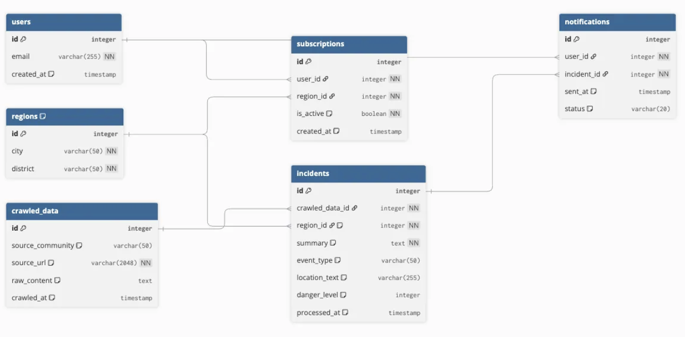

# 🌳 Yogi-Josim (여기조심) - `develop` 브랜치

> **우리 동네의 작은 위험 신호를 실시간으로 포착하여 알려주는 서비스**  
> 칼부림, 음주운전 등 위험 상황을 빠르게 감지해 사용자에게 알림을 제공하여  
> 더 안전한 지역 사회를 만드는 것을 목표로 합니다.  

---

## 🚀 배포 주소

> 현재 서비스는 배포되어 있어 별도의 로컬 실행이 필요하지 않습니다.  
> 아래 링크에서 바로 이용하실 수 있습니다.  

🔗 [배포된 서비스 바로가기](https://yogijosim.netlify.app/)

---

## 🏛️ 아키텍처 (Architecture)

> 전체 서비스의 흐름도입니다.

---

## 🛠️ 기술 스택 (Tech Stack)

| 구분         | 기술                                                             |
| ------------ |----------------------------------------------------------------|
| **Backend** | Java 17, Spring Boot 3.5.4, Spring Data JPA                     |
| **Database** | MySQL                                                          |
| **Infra** | Docker, AWS(EC2, RDS)                                            |
| **Tools** | IntelliJ IDEA, Git, GitHub, Swagger                               |

---

## 🗃️ ERD (Entity-Relationship Diagram)

> 데이터베이스의 구조입니다.

---
## 주요 기능 및 특징 (Key Features)

- **실시간 위험 정보 수집**  
  Python 기반의 독립된 크롤링 서버가 다양한 온라인 커뮤니티와 SNS 게시글을 24시간 수집하여 잠재적 위험 정보를 놓치지 않고 포착합니다.  

- **자동화된 위험도 분류**  
  자체 설계한 키워드 매칭 알고리즘을 통해 데이터를 분석합니다.  
  `'흉기'`, `'칼부림'` 등 심각도가 높은 키워드를 기반으로 **위험도를 5단계로 자동 분류**하여 중요도를 직관적으로 판단할 수 있습니다.  

- **지능형 맞춤 알림 시스템**  
  - **즉시 알림**: "매우 높음"으로 분류된 고위험 사건은 즉시 구독자에게 긴급 메일 발송  
  - **정기 알림**: 그 외 사건은 사용자가 설정한 주기(매일/매주)에 맞춰 ‘지역 안전 리포트’ 형태로 발송  

- **사용자 중심의 구독 설정**  
  사용자가 관심 지역과 알림 주기를 직접 선택 가능 → 꼭 필요한 정보만 필터링  

- **시스템 구조 및 데이터 흐름**  
  데이터 수집 → 처리 및 저장 → 알림 발송의 **3단계 워크플로우**로 설계  
  - (데이터 수집) Python 크롤링 서버 → Raw Text 전달  
  - (데이터 처리/저장) 키워드 매칭 및 지역·위험도 분석 → Incident 객체로 가공 후 DB 저장  
  - (알림 발송) Spring Scheduler + JavaMailSender → 즉시/정기 메일 전송  
  - (사용자 구독) Vue.js 프론트엔드 → 이메일/지역/주기 선택 후 안전 저장  

---

## 🤝 Git 컨벤션 (Git Convention)

### 브랜치 전략 (Git Flow)
- **main**: (**Protected**) 제품으로 출시될 수 있는 브랜치. 배포 시 태그(tag)를 사용하여 버전 기록.  
- **develop**: (**Protected**) 다음 출시 버전을 개발하는 메인 브랜치. 모든 feature 브랜치가 이곳으로 merge.  
- **feature/{기능}**: 새로운 기능 개발 및 리팩토링. develop에서 분기하여 develop으로 merge.  
- **release/{버전}**: 새 버전 출시 준비. QA 및 버그 수정 후 main과 develop에 모두 merge.  
- **hotfix/{이슈}**: main에 배포된 긴급 버그 수정. 완료 후 main과 develop에 모두 merge.  

### 커밋 메시지 규칙
- **feat**: 새로운 기능 추가  
- **fix**: 버그 수정  
- **docs**: 문서 수정 (README 등)  
- **style**: 코드 포맷팅, 세미콜론 누락 등 (코드 변경 없음)  
- **refactor**: 코드 리팩토링  
- **test**: 테스트 코드 추가/수정  
- **chore**: 빌드, 패키지 매니저 설정 등 (프로덕션 코드 변경 없음)  

---

## 🧑‍💻 팀원 정보 (Our Team)

||||
|:---:|:---:|:---:|
|**🐝 [유동우](http://github.com/fbehddn)**|**🐝 [정재우](http://github.com/holyPigeon)**|**🐝 [홍공진](http://github.com/Gongjjin)**|
|백엔드|백엔드|백엔드|

 
